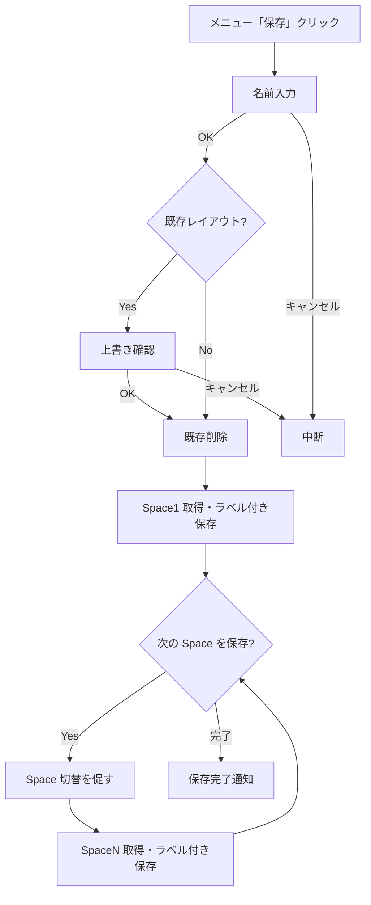
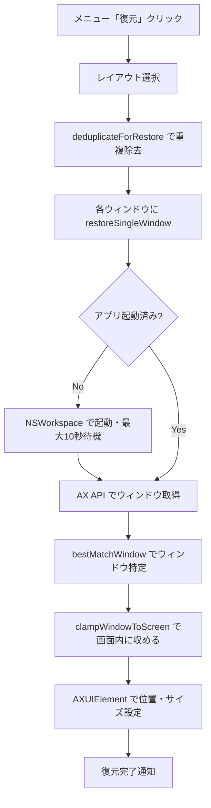
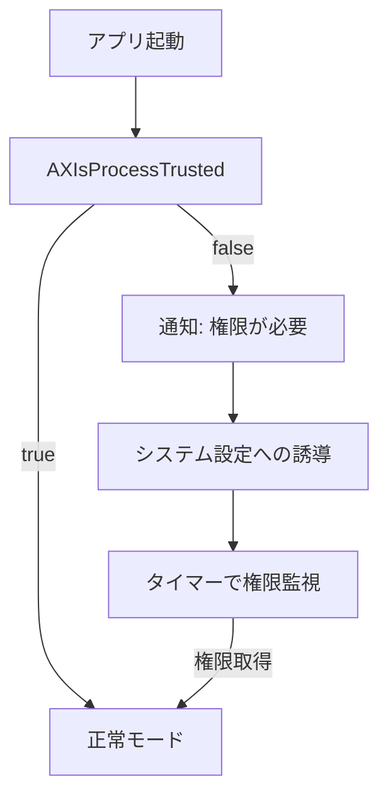

# Window Restore — 設計・実装ガイド

> 統合元: `docs/WINDOW_RESTORE_DESIGN.md`  
> 最終更新: 2026-02-20（Xcode プロジェクト移行に伴い改訂）

---

## 1. コア概念

### アクセシビリティ権限（必須）

- 他アプリの UI を操作（位置変更）するには TCC の「アクセシビリティ」許可が必要
- 許可は **.app バンドルに紐づく**ため、.app をダブルクリックで起動すること（バイナリ直起動は不可）
- 変更後はアプリの再起動が必要。`/Applications` 配置後は再登録する

### ウィンドウ列挙（取得）

- `CGWindowListCopyWindowInfo` で表示中ウィンドウのスナップショットを取得
- 各ウィンドウについて ownerName、PID、タイトル、フレーム（X/Y/W/H）、レイヤー等が取れる
- システム UI（Dock、メニューバー等）も混ざるため除外フィルタが重要

### 復元（移動の実体）

- `AXUIElementCreateApplication(pid)` で対象アプリの AX 要素を取得
- `kAXWindowsAttribute` でウィンドウ一覧を取得
- `kAXPositionAttribute` / `kAXSizeAttribute` を `AXValueCreate` で設定

> **Xcode 移行による変更点**
>
> | 変更前 | 変更後 |
> |--------|--------|
> | ~~AppleScript（System Events）で `window.position` を設定~~ | Accessibility API（`AXUIElement`）で直接設定 |
> | ~~Rust FFI 経由で呼び出し~~ | Swift で直接実装（`WindowManager.swift`） |

### マルチディスプレイ / 座標

- 画面座標系とディスプレイ座標系の差異を考慮（メニューバー位置、原点の違い）
- 復元時にディスプレイ情報を更新し、保存時の位置を再投影する

---

## 2. コンポーネント構成

### 一覧

```
WindowRestore/
├── main.swift                 … NSApplication 起動
├── AppDelegate.swift          … ライフサイクル管理、各コンポーネント初期化
├── WindowManager.swift        … ウィンドウ取得/保存/復元（コアロジック）
├── MenuController.swift       … メニューバー UI
├── PermissionManager.swift    … アクセシビリティ権限チェック・監視
├── SettingsWindow.swift       … 設定画面
├── LayoutSelector.swift       … レイアウト選択/削除ダイアログ
├── FileHelper.swift           … ディレクトリ解決、JSON I/O
├── LayoutAPI.swift            … レイアウト操作 API ファサード
├── QuitWindow.swift           … 終了確認
└── SecondaryStatusIcons.swift … マルチディスプレイ用ステータスアイコン
```

> **Xcode 移行による変更点**
>
> - ~~`mac-app/Sources/`~~ → `WindowRestore/` にソース配置
> - ~~`mac-app/Sources/Resources/`（SPM リソース）~~ → `WindowRestore/Assets.xcassets/`
> - ~~`mac-app/Package.swift`~~ → `WindowRestore.xcodeproj/project.pbxproj`

### 各コンポーネントの詳細

**WindowManager.swift**（コアロジック）
- `fetchVisibleAppWindows()` — 現在のウィンドウ配列を取得
- `saveWindows(name:)` / `saveWindowsAppend(name:label:)` — JSON 保存
- `loadWindows(name:)` — JSON 読み込み
- `restoreWindows(name:)` — 復元処理（全 Space 一括、重複除去・画面外防止込み）
- `listLayouts()` / `deleteLayout(name:)` — レイアウト管理
- `layoutExists(name:)` — 上書き確認用の存在チェック
- `hasLabel(name:label:)` / `nextAvailableLabel(name:baseLabel:)` — マルチ Space ラベル管理
- `layoutLabels(in:)` — ラベル一覧取得
- `replaceWindowsForLabel(name:label:with:)` — ラベル差し替え

**FileHelper.swift**
- `resolveBaseDirectory()` — 保存先ディレクトリ解決（環境変数 → Application Support → フォールバック）
- `saveJSON(_:to:)` / `loadJSON(from:)` — 汎用 JSON I/O
- `listFiles(in:extension:)` / `deleteFile(at:)` — ファイル操作

**LayoutAPI.swift**（ファサード）
- レイアウト操作（保存/復元/削除/一覧）の統一エントリポイント
- 内部で `WindowManager` のメソッドを呼び出す
- `APIResult<T>` 型でエラーコード付きの結果を返す

**PermissionManager.swift**
- `AXIsProcessTrusted()` で権限チェック
- タイマーで定期的に権限状態を監視
- 権限取得時にデリゲートへ通知

---

## 3. 処理フロー

### 3.1 保存フロー



### 3.2 復元フロー



### 3.3 権限チェックフロー



---

## 4. 典型トラブルと対処

### 権限が false のまま

1. .app を `/Applications` に配置
2. システム設定 > プライバシーとセキュリティ > アクセシビリティ で再登録（既存削除 → 再追加）
3. .app をダブルクリックで起動（バイナリ直起動は不可）
4. 解決しない場合:
   ```bash
   tccutil reset Accessibility local.window-restore
   codesign --force --deep --sign - /Applications/WindowRestore.app
   xattr -dr com.apple.quarantine /Applications/WindowRestore.app
   ```

### 復元が無反応

- JSON にシステム UI や極小ウィンドウが混入 → フィルタ済みで再保存
- 通知権限が未許可でエラーが見えない → ターミナルから起動してログ確認
- 対象アプリが未起動 → 自動起動して最大 10 秒待機してから復元を試みる

### 期待と違うウィンドウが動く

- `bestMatchWindow` がタイトル完全一致 → 座標最近傍の順で選択するため、通常は正しいウィンドウが選ばれる
- タイトルが空のアプリでは保存時の座標に最も近いウィンドウが選択される

---

## 5. コード読み解きガイド

### 5.1 読み順（30 分で全体像）

1. **UI の入口** — `AppDelegate.swift` / `MenuController.swift`
   - 何がトリガーで何を呼ぶか（保存/復元/削除/一覧）
2. **API レイヤー** — `LayoutAPI.swift`
   - レイアウト操作の統一ファサード
3. **コアロジック** — `WindowManager.swift`
   - ウィンドウ取得・保存・復元のすべて
4. **ファイル I/O** — `FileHelper.swift`
   - ディレクトリ解決、JSON 読み書き
5. **権限** — `PermissionManager.swift`
   - `AXIsProcessTrusted()` のチェックと監視

> **Xcode 移行による変更点**
>
> | 変更前 | 変更後 |
> |--------|--------|
> | ~~`mac-app/Package.swift` を確認（リンク設定）~~ | `WindowRestore.xcodeproj` の Build Settings を確認 |
> | ~~`scripts/make_app.sh` を確認（.app 構成）~~ | Xcode が自動管理 |

### 5.2 操作別トレース

**保存（Save）**
1. `MenuController` → ユーザーが名前入力
2. `AppDelegate.saveCurrentLayout(name:)` → 既存確認・ループ開始
3. `WindowManager.saveWindowsAppend(name:label:)` で各 Space をラベル付き保存
4. 「次の Space を保存?」確認 → Yes なら Space 切替を促して繰り返し

**復元（Restore）**
1. `MenuController` → レイアウト選択
2. `AppDelegate.restoreLayout(name:)` → `LayoutAPI.restoreLayout(name:)` → `WindowManager.restoreWindows(name:)`

**一覧 / 削除**
- `LayoutAPI.listLayouts()` → `WindowManager.listLayouts()`
- `LayoutAPI.deleteLayout(name:)` → `WindowManager.deleteLayout(name:)`

### 5.3 ビルドと実行

```bash
# Xcode で開く
open WindowRestore.xcodeproj

# ビルド: Cmd+B
# 実行: Cmd+R
```

> **Xcode 移行による変更点**
>
> | 変更前 | 変更後 |
> |--------|--------|
> | ~~`cd mac-app && swift build`~~ | Xcode で Cmd+B |
> | ~~`bash scripts/make_app.sh`~~ | Xcode が自動で .app 生成 |
> | ~~`RUST_LOG=info` で起動してログ確認~~ | Xcode Console でログ確認 |

---

## 付録: 旧 Rust 実装のコンポーネント（参考）

以下は Rust + FFI 時代のコンポーネントです。現在はすべて Swift に置き換え済み。

<details>
<summary>旧 Rust コンポーネント一覧</summary>

| Rust モジュール | 役割 | 現在の対応 |
|---|---|---|
| `src/window_scanner.rs` | CGWindowList でウィンドウ列挙 | `WindowManager.fetchVisibleAppWindows()` |
| `src/window_restorer.rs` | AppleScript でウィンドウ移動 | `WindowManager.restoreWindows(name:)`（AX API） |
| `src/layout_manager.rs` | JSON 保存/読込/一覧/削除 | `WindowManager` + `FileHelper` |
| `src/config.rs` | 設定ファイル管理 | `SettingsWindow` |
| `src/app_launcher.rs` | アプリ起動支援 | 未使用（復元時に必要なら拡張可能） |
| `src/display_manager.rs` | ディスプレイ座標管理 | `WindowManager` 内で処理 |
| `src/permission_checker.rs` | `AXIsProcessTrusted()` | `PermissionManager.swift` |
| `src/notification.rs` | 通知管理 | `AppDelegate` 内の `postUserNotification()` |
| `src/ffi.rs` | C 互換エクスポート | `LayoutAPI.swift` |

</details>
