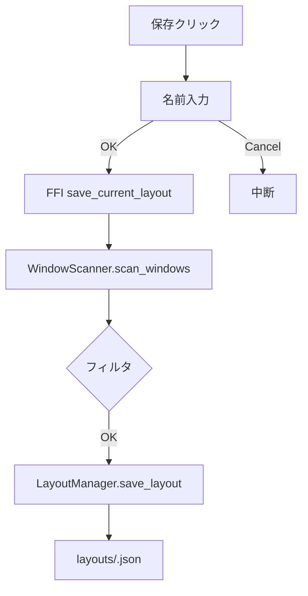
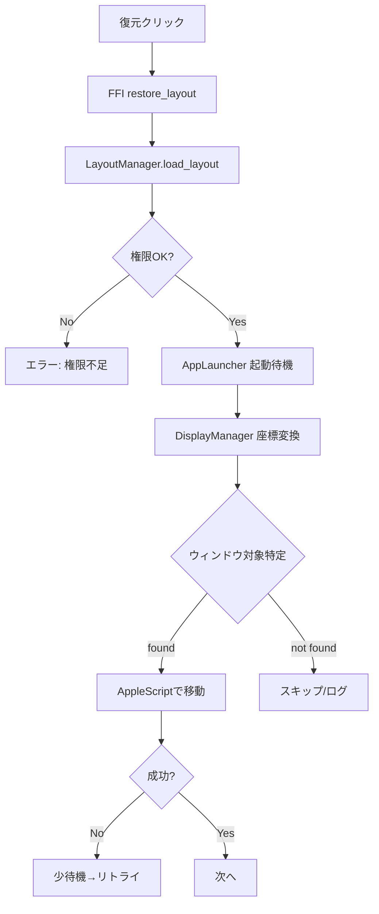

### macOSでウィンドウを自動配置（移動）する仕組み・詳細解説（Window Restore）

本ドキュメントは、Window Restore が macOS 上で「ウィンドウの保存・復元（移動）」を行う仕組みを、実装レベルでわかりやすく説明します。現状の制約や改善案、具体的なフロー（Mermaid）も含みます。

---

## 1. コア概念（何が必要で、どう動くか）

- アクセシビリティ権限（必須）
  - 他アプリの UI を操作（位置変更）するには TCC の「アクセシビリティ」許可が必要。
  - 許可は .app バンドルに紐づくため、アプリは .app をダブルクリックで起動すること（内部バイナリ直起動は不可）。
  - 変更後はアプリの再起動が必要。/Applications 配置後は再登録する。

- ウィンドウ列挙（取得）
  - Core Graphics の `CGWindowListCopyWindowInfo` で「表示中のウィンドウ」のスナップショットを取得。
  - 各ウィンドウについて ownerName（アプリ名相当）、PID、タイトル、フレーム（X/Y/W/H）、レイヤー（kCGWindowLayer）等が取れる。
  - システム UI（Dock、メニューバー等）も混ざるので「除外フィルタ」が重要。

- アプリ識別（bundle id）
  - 復元時に対象アプリを起動/特定するには bundle identifier が必要。
  - 理想は PID → NSRunningApplication/LaunchServices で正しい bundle id を解決して保存。

- 復元（移動の実体）
  - 実装容易性のため、AppleScript（System Events）で window.position を設定。
  - 対象ウィンドウの特定はアプリ名/バンドルID＋タイトル一致等を用い、リトライも行うのが安定的。

- マルチディスプレイ/座標
  - 画面座標系とディスプレイ座標系の差異を考慮（メニューバー位置、原点の違い）。
  - 復元時にディスプレイ情報を更新し、保存時の位置を良い感じに再投影する。

- 例外
  - Window Server、Dock、メニューバー、壁紙などは「ウィンドウ」だが移動不可。
  - サンドボックスや特殊 UI のアプリは操作が制限され得る。

---

## 2. プロジェクト内コンポーネント（役割と現状）

- スキャナ: `src/window_scanner.rs`
  - 役割: Core Graphics で表示中ウィンドウを列挙し、`WindowInfo` を生成。
  - 現状: ownerName/PID/title/frame/level を抽出。bundle_id は暫定の `com.app.<pid>`、display_uuid は暫定の "main"。
```127:149:/Users/sasata/Documents/work_space/Rust/window_restore/src/window_scanner.rs
fn parse_window(window_dict: CFDictionaryRef) -> Result<WindowInfo> {
    // ownerName, PID, title, bounds, layer を取り出し WindowInfo に詰める
}
```

- レイアウト管理: `src/layout_manager.rs`
  - 役割: JSONへの保存/読み込み/一覧/削除。保存先は `~/Library/Application Support/window_restore/layouts/`（環境変数 `WINDOW_RESTORE_DATA_DIR` 指定可）。
  - バリデーション: レイアウト名、ウィンドウ配列の健全性検証。
```96:130:/Users/sasata/Documents/work_space/Rust/window_restore/src/layout_manager.rs
pub fn save_layout(&self, name: &str, windows: &[WindowInfo]) -> Result<()> {
    // バリデーション → JSON保存（created_at/updated_at 付与）
}
```

- 復元ロジック: `src/window_restorer.rs`
  - 役割: 権限チェック → ディスプレイ情報更新 → 必要アプリの起動待機 → ウィンドウ移動（AppleScript）
```53:62:/Users/sasata/Documents/work_space/Rust/window_restore/src/window_restorer.rs
pub fn restore_layout(&mut self, layout: &Layout) -> Result<()> {
    // 権限チェック、ディスプレイ更新、アプリ起動、インターバル待機、移動ループ
}
```
```166:199:/Users/sasata/Documents/work_space/Rust/window_restore/src/window_restorer.rs
fn try_restore_window_position(&self, window: &WindowInfo, x: f64, y: f64) -> Result<()> {
    // AppleScript で window.position を設定
}
```

- 権限: `src/permission_checker.rs`
  - 役割: `AXIsProcessTrusted()` でアクセシビリティ権限の有無を判定、設定画面の起動。
```24:30:/Users/sasata/Documents/work_space/Rust/window_restore/src/permission_checker.rs
pub fn check_accessibility_permission(&self) -> bool {
    unsafe { AXIsProcessTrusted() != 0 }
}
```

- FFI: `src/ffi.rs`
  - 役割: Swift から保存/復元/一覧/削除/権限チェックを呼び出す C 互換API。
  - 失敗時はエラーコードと詳細メッセージを返す。
```62:80:/Users/sasata/Documents/work_space/Rust/window_restore/src/ffi.rs
#[no_mangle]
pub extern "C" fn save_current_layout(name: *const c_char) -> i32 { /* 入口 */ }
```

- macOS アプリ（UI）
  - `mac-app/Sources/AppDelegate.swift` … 起動・メニュー構築・通知・デリゲート処理
  - `mac-app/Sources/MenuController.swift` … 保存/復元/削除メニュー、一覧更新
  - `mac-app/Sources/RustAPI.swift` … FFI関数の型安全ラッパー
  - `mac-app/Sources/PermissionManager.swift` … 許可誘導・監視

---

## 3. 保存の詳細（何をどの順で保存しているか）

1) ユーザー操作: メニュー「保存」→ 名前入力
2) Swift → Rust FFI: `save_current_layout(name)` を呼ぶ
3) Rust 側でウィンドウ列挙: `WindowScanner.scan_windows()`
   - 取得キー例: kCGWindowOwnerName（アプリ名）, kCGWindowOwnerPID（PID）, kCGWindowName（タイトル）, kCGWindowBounds（X/Y/W/H）, kCGWindowLayer（レイヤー）
4) フィルタ（現状）
   - FFI 側で最低限の無効値（空タイトル等）を除外
   - ただしシステムUIやメニューバー等は混入し得る（改善余地あり）
5) JSON保存: `LayoutManager.save_layout`
   - スキーマ（要点）
     - `layout_name`, `created_at`, `updated_at`, `windows[]`
     - 各 `window`: `app_name`, `bundle_id(暫定)`, `title`, `frame{x,y,width,height}`, `display_uuid(暫定)`, `window_level`, `is_minimized`, `is_hidden`

保存先パスの解決（優先順）:
- `WINDOW_RESTORE_DATA_DIR` があれば `.../layouts`
- なければ `dirs::data_dir()/window_restore/layouts`
- 取得不可時はカレント配下の `target/window_restore/layouts`（テスト用途）

---

## 4. 復元の詳細（どうやって動かすか）

1) ユーザー操作: メニュー「復元」→ レイアウト選択
2) Swift → Rust FFI: `restore_layout(name)` を呼ぶ
3) JSON読込: `LayoutManager.load_layout`
4) 前提チェック: `PermissionChecker.check_accessibility_permission()` が false なら即失敗
5) アプリ起動: `AppLauncher` で必要に応じて対象アプリを起動/待機
6) ディスプレイ更新: `DisplayManager.refresh_displays()` で座標変換準備
7) ウィンドウ移動: `try_restore_window_position`
   - AppleScript（System Events）例（簡略）
```text
tell application "System Events"
  tell application process "<AppName>"
    set position of first window to {<x>, <y>}
  end tell
end tell
```
   - 正確には `application id "<bundle id>"` や `windows whose name is "<title>"` を併用すると特定精度が上がる
8) リトライ: 短い待機を挟みつつ数回試行

注意:
- システムUI（Dock/メニューバー/壁紙等）は移動不可のためスキップ対象
- 複数ウィンドウを持つアプリは「最初のウィンドウ(first window)」では期待とズレる場合があり、タイトル一致が望ましい

---

## 5. 現状の制約（なぜズレる/動かないことがあるか）

- bundle_id が暫定（`com.app.<pid>`）
  - 正式な bundleIdentifier を保存できていないため、復元時のアプリ特定/起動に弱い。
- display_uuid が暫定（"main"）
  - マルチディスプレイでの座標再投影が正しく行えない。
- システムUI混入
  - Dock/メニューバー等が JSON に含まれると、移動不可エラーや無反応の原因になる。
- AppleScript の対象特定が粗い
  - first window 指定は複数窓アプリで外しやすい。タイトル一致や前面化が必要。

---

## 6. 改善方針（具体）

- 保存品質の向上（スキャナ側）
  - 除外: ownerName ∈ {"Window Server","Dock","Notification Center","Control Center","Spotlight","TextInputMenuAgent"} など
  - レイヤー: `kCGWindowLayer == 0` のみ採用
  - サイズ: 高さしきい値（例: ≥ 80px）や面積しきい値で極小 UI を除外
  - bundle id 解決: PID → `NSRunningApplication(processIdentifier:)` → `bundleIdentifier`
  - display UUID: `CGDisplayCreateUUIDFromDisplayID` で実 UUID を採取

- 復元精度の向上
  - AppleScript を `application id "<bundle id>"` で対象指定
  - `windows whose name is "<title>"` でウィンドウを同定（無ければフォールバック）
  - アクティブ化→移動→小休止→再検証のリトライ

- エラーハンドリング/通知
  - 通知権限未許可時は NSAlert で確実に可視化
  - 失敗理由（権限/対象なし/移動不可）をUIに表示

---

## 7. フロー図（詳細）

### 7.1 保存フロー（詳細）

フィルタ例:
- レイヤー!=0 除外、ownerName がシステムUIなら除外、極小 UI 除外、タイトル空は除外、bundle id 解決

### 7.2 復元フロー（詳細）


---

## 8. 典型トラブルと対処

- 権限が false のまま
  - /Applications へ配置 → アクセシビリティで再登録（既存削除→再追加）→ .app ダブルクリックで起動
  - 反映されない場合: `tccutil reset Accessibility local.window-restore`、必要なら `codesign --force --deep --sign -`、`xattr -dr com.apple.quarantine` を実施

- 復元が無反応
  - JSON にシステムUI/極小 UI が多い → フィルタして保存し直す
  - 通知権限が無く失敗が見えない → NSAlert へのフォールバック実装

- 期待と違うウィンドウが動く
  - first window 指定が外れている → タイトル一致やウィンドウ列挙で対象特定を強化

---

## 9. 主要コード参照（抜粋）

保存入口（FFI）:
```62:80:/Users/sasata/Documents/work_space/Rust/window_restore/src/ffi.rs
pub extern "C" fn save_current_layout(name: *const c_char) -> i32 { /* FFI入口 */ }
```

JSON保存:
```96:130:/Users/sasata/Documents/work_space/Rust/window_restore/src/layout_manager.rs
pub fn save_layout(&self, name: &str, windows: &[WindowInfo]) -> Result<()> { /* JSON保存 */ }
```

復元ロジック:
```53:111:/Users/sasata/Documents/work_space/Rust/window_restore/src/window_restorer.rs
pub fn restore_layout(&mut self, layout: &Layout) -> Result<()> { /* 権限→起動→移動 */ }
```
```166:199:/Users/sasata/Documents/work_space/Rust/window_restore/src/window_restorer.rs
fn try_restore_window_position(&self, window: &WindowInfo, x: f64, y: f64) -> Result<()> { /* AppleScript */ }
```

権限チェック:
```24:30:/Users/sasata/Documents/work_space/Rust/window_restore/src/permission_checker.rs
pub fn check_accessibility_permission(&self) -> bool { /* AXIsProcessTrusted */ }
```

Swift 側呼び出し:
```22:36:/Users/sasata/Documents/work_space/Rust/window_restore/mac-app/Sources/RustAPI.swift
static func saveLayout(name: String) -> RustResult<Void> { /* save_current_layout */ }
```
```264:301:/Users/sasata/Documents/work_space/Rust/window_restore/mac-app/Sources/AppDelegate.swift
func restoreLayout(name: String) { /* RustAPI.restoreLayout を呼び出し */ }
```

---

この文書は `target/` 配下（GitHub除外）に保管しています。


---

## 10. 実装コード読み解きガイド（読み順・トレース・検索・ログ）

この節は「素早く原因に当たりたい」人向けの実践ガイドです。読み順、操作別の追い方、rg検索クエリ、ログ観測ポイントをまとめています。

### 10.1 安全な読み順（30分で全体像）

1) UIの入口（Swift）
   - `mac-app/Sources/AppDelegate.swift`
   - `mac-app/Sources/MenuController.swift`
   - 何がトリガーで何を呼ぶか（保存/復元/削除/一覧）を把握

2) Swift→Rustブリッジ
   - `mac-app/Sources/RustAPI.swift`（FFI関数の型安全ラッパ）
   - `src/ffi.rs`（Cエクスポート関数の実体）

3) 保存/一覧/削除の永続化
   - `src/layout_manager.rs`（JSON）

4) 復元の実体
   - `src/window_restorer.rs`（権限→起動→座標変換→AppleScript移動）
   - `src/permission_checker.rs`（権限）
   - `src/window_scanner.rs`（取得）

5) 補助
   - `mac-app/Package.swift`（リンク設定）
   - `scripts/make_app.sh`（.app バンドル構成と rpath 修正）

### 10.2 操作別トレース（どこを追うか）

- 保存（Save）
  1. `MenuController.saveCurrentLayout()`
  2. `AppDelegate.saveCurrentLayout(name:)`
  3. `RustAPI.saveLayout(name:)`
  4. `ffi.rs: save_current_layout`（ログ: FFI save_current_layout called/succeeded）
  5. `WindowScanner.scan_windows()` → FFI側のフィルタ
  6. `LayoutManager.save_layout()` → JSONへ

- 復元（Restore）
  1. `MenuController.restoreLayout(_:)`
  2. `AppDelegate.restoreLayout(name:)`
  3. `RustAPI.restoreLayout(name:)`
  4. `ffi.rs: restore_layout`
  5. `LayoutManager.load_layout()`
  6. `WindowRestorer.restore_layout()`
     - `PermissionChecker.check_accessibility_permission()`
     - `DisplayManager.refresh_displays()`
     - `AppLauncher.launch_app()` / `wait_for_app()`
     - `try_restore_window_position()`（AppleScript）

- 一覧（List）/削除（Delete）
  - `RustAPI.listLayouts()` / `RustAPI.deleteLayout(name:)`
  - `ffi.rs: get_layout_list` / `ffi.rs: delete_layout`
  - `LayoutManager.list_layouts()` / `LayoutManager.delete_layout()`

### 10.3 よく使う rg 検索クエリ（コピペ可）

```bash
# FFIエクスポート関数（Swiftから呼び出すC関数）
rg "^pub extern \"C\" fn" src/ffi.rs

# 保存/復元の入口（Swift側）
rg "saveLayout\(|restoreLayout\(" mac-app/Sources

# 権限チェック関連
rg "AXIsProcessTrusted|check_accessibility" src mac-app/Sources

# AppleScript 実行箇所
rg "osascript|System Events|set position" src

# JSON保存/読込
rg "save_layout\(|load_layout\(|list_layouts\(|delete_layout\(" src/layout_manager.rs
```

### 10.4 ログ観測ポイント（RUST_LOG=info 推奨）

- FFI保存ログ
  - `[window_restore::ffi] FFI save_current_layout called/succeeded`
- 一覧件数
  - `[window_restore::ffi] FFI get_layout_list count=...`
- 復元開始
  - `[window_restore::window_restorer] Restoring layout: <name>`
- 権限チェック
  - `PermissionChecker` 経由 → UI側にも「アクセシビリティ権限チェック結果: true/false」
- ディスプレイ情報
  - `[window_restore::display_manager] Refreshing display information`
- 保存成功
  - `[window_restore::layout_manager] Layout saved: <name>`

### 10.5 典型的な「無反応」を潰す視点

- 通知権限が無くエラー通知が出ない → NSAlert にフォールバックするか、ターミナル起動でログ確認
- アクセシビリティ false → まず true にする（/Applications 配置→再登録→再起動）
- JSONがシステムUIだらけ → Finder/TextEdit 等の通常ウィンドウのみで保存し直す
- AppleScript の対象特定が粗い → bundle id + タイトル一致に改善（実装タスク）

### 10.6 「どこを直せば効果が出るか」改修の当たり順

1) スキャンの品質
   - `window_scanner.rs`: システムUI除外、layer==0、極小UI除外、PID→bundle id 解決
2) 復元の対象特定
   - `window_restorer.rs`: first window → title一致（なければフォールバック）、application id 使用
3) 権限/署名/配置
   - /Applications 配置、`codesign --force --deep --sign -`、TCC 再登録
4) エラーハンドリング
   - 通知失敗時の NSAlert、FFI側の詳細ログ

### 10.7 最短トレース手順（保存→復元を追う）

1) `RUST_LOG=info` で .app を起動（ターミナル）
2) 保存実行 → FFI save 呼び出しログ確認 → JSON生成確認
3) 復元実行 → 権限/起動/座標変換/AppleScript 移動の各ログを順に確認
4) どこで止まるかを特定し、その層のコード（UI/FFI/保存/復元/権限/スキャン）だけを重点的に読む
